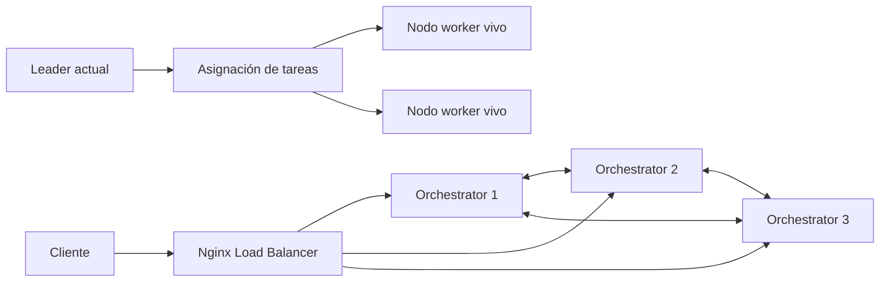
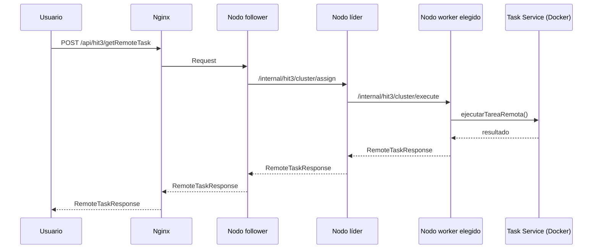
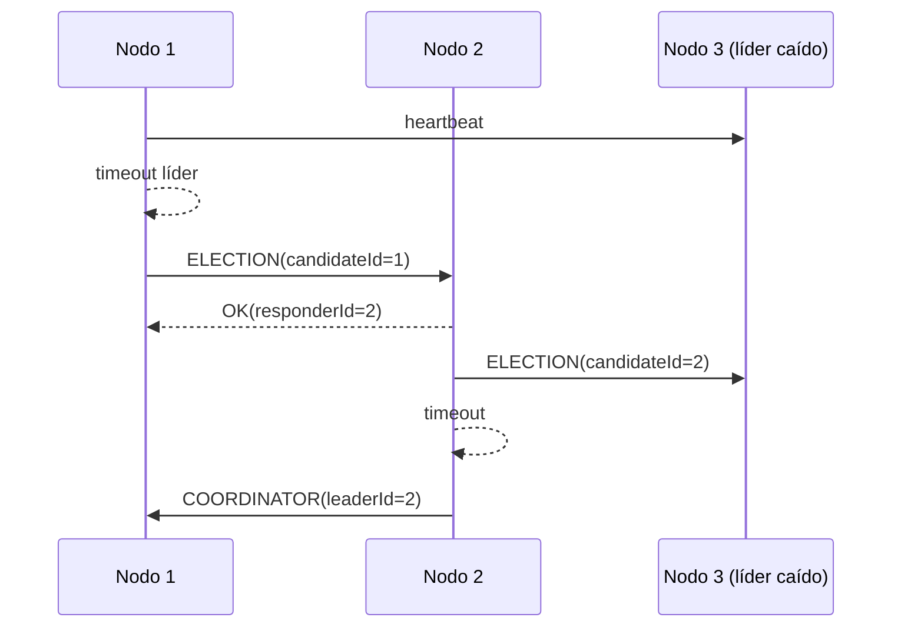

# HIT3 - Coordinación y Tolerancia a Fallos

Este documento resume la implementación de HIT3 con:

- Balanceador de carga (Nginx) delante de 3 instancias de orquestador.
- Elección de líder con algoritmo Bully.
- Asignación de tareas centralizada por el líder.
- Heartbeats + failover automático ante caída del coordinador.

## Arquitectura general



## Flujo de una tarea



## Elección de líder y failover (Bully)



## Requisitos previos

- Docker funcionando.
- `docker-compose.hit3.yml` configurado con 3 nodos + Nginx.
- Variable `TASK_SERVICE_HOST` correcta en cada nodo del compose.
- Imagen de task service disponible en DockerHub.

## Levantar entorno

```bash
docker pull ulisescasal/orchestrator-server:1.0.0
docker compose -f docker-compose.hit3.yml up -d
docker ps
```

## Endpoints relevantes

- Público: `POST /api/hit3/getRemoteTask`
- Estado cluster: `GET /internal/hit3/cluster/status`
- Internos de coordinación:
  - `POST /internal/hit3/cluster/heartbeat`
  - `POST /internal/hit3/cluster/election`
  - `POST /internal/hit3/cluster/coordinator`
  - `POST /internal/hit3/cluster/assign`
  - `POST /internal/hit3/cluster/execute`

## Ejecución de pruebas automáticas

Se incluye script de casos de uso en:

- `./hit3_test_suite.sh`

Uso:

```bash
bash ./hit3_test_suite.sh
```

Opciones:

```bash
bash ./hit3_test_suite.sh --base-url http://localhost:8090 --image ulisescasal/task-service:1.0.0
bash ./hit3_test_suite.sh --up
bash ./hit3_test_suite.sh --down
```

El script cubre:

- Disponibilidad del estado del cluster.
- Detección de líder actual.
- Ejecución de tarea simple.
- Ejecución concurrente.
- Caída del líder + nueva elección automática.
- Medición de tiempo de recuperación.
- Redistribución de tareas tras failover.
- Recuperación del nodo caído.

## Apagar entorno

```bash
docker compose -f docker-compose.hit3.yml down
```
